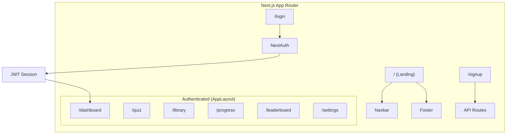

# Transform Lingoleap to a Dynamic Next.js Web Application

## Background

The existing Lingoleap (AI Study Buddy) project is a **static multi-page HTML/CSS/JS site** with 8 standalone `.html` files, a single `styles.css` (1,258 lines of Neo-Brutalist design system), and one `app.js` file for quiz logic. There is no backend, database, or authentication — all data is hardcoded. The goal is to migrate this into a **dynamic Next.js (JavaScript)** application, preserving the existing design identity while enabling real interactivity.

---

## Existing Codebase Inventory

| File | Purpose |
|---|---|
| `index.html` | Marketing landing page (hero, stats, modules, comparison, vision, CTA, footer) |
| `login.html` | Login form (redirects to dashboard via `<form action>`) |
| `signup.html` | Sign-up form with target exam selector |
| `dashboard.html` | App dashboard with sidebar, daily goal, quiz card, recent decks |
| `quiz.html` + `app.js` | Interactive quiz with 5 hardcoded questions, XP scoring, animations |
| `library.html` | Document library table with mock data |
| `progress.html` | Analytics page with band score, bar chart |
| `leaderboard.html` | Weekly XP leaderboard table |
| `settings.html` | Profile form + preferences toggles |
| `styles.css` | Full Neo-Brutalist design system (1,258 lines) |
| `assets/` | 12 files: `logo.svg`, hero/comparison PNGs, SVG icons |

---

## User Review Required

> [!IMPORTANT]
> **Key decisions that will shape the migration:**

1. **Database choice** — I plan to start with **local JSON files / in-memory state** for Phase 1 so you can see the app working immediately. A real database (e.g. Supabase, Firebase, or Prisma+Postgres) can be added in a future phase. Is that okay, or do you want a specific database from day one?

2. **Authentication** — For Phase 1 I plan to use **NextAuth.js** with a simple credential-based flow (email/password). This can later be extended with Google/GitHub OAuth. Does that work?

3. **Deployment target** — Are you planning to deploy on **Vercel** (the default for Next.js), or somewhere else?

4. **Scope** — This plan covers the full structural migration. AI-powered features (real quiz generation from notes, writing feedback, speaking coach) are listed as future phases since they require API integrations. Should any AI features be prioritized in Phase 1?

---

## Proposed Changes

The project will be initialized at **the same workspace location** (`/Users/chenelle/Desktop/Ai study buddy`) as a fresh Next.js app. Existing static files will be preserved in a backup folder during migration.

### Phase 1: Project Initialization & Shared Layout

#### [NEW] `package.json`
- Created by `npx create-next-app@latest`
- Dependencies: `next`, `react`, `react-dom`, `next-auth` (for auth)

#### [NEW] `src/app/layout.js`
- Root layout with `<html>`, `<body>`, Google Fonts (Plus Jakarta Sans via `next/font/google`), global metadata (title, description, favicon)

#### [NEW] `src/app/globals.css`
- Port the full `styles.css` design system (CSS variables, Neo-Brutalist tokens, all component styles, animations, responsive breakpoints)
- Quiz-specific inline `<style>` from `quiz.html` merged here

#### [NEW] `src/components/Navbar.jsx`
- Marketing site navbar extracted from `index.html` lines 27–41
- Uses `next/link` for routing instead of `.html` hrefs

#### [NEW] `src/components/Sidebar.jsx`
- App sidebar extracted from `dashboard.html` lines 28–60 (duplicated across 5 pages)
- Active link highlighting via `usePathname()` hook
- User profile section at bottom

#### [NEW] `src/components/AppLayout.jsx`
- Wraps all authenticated pages with `<Sidebar>` + `<main className="main-content">`
- Eliminates the sidebar HTML duplication across 5 files

#### [NEW] `src/components/Footer.jsx`
- Marketing footer extracted from `index.html` lines 285–316

---

### Phase 2: Marketing Pages (Public)

#### [NEW] `src/app/page.js`
- Landing page migrated from `index.html`
- Sections: Hero, Stats, Modules, Comparison, Features, Vision Board, CTA
- All static content preserved, images via `next/image` with optimization

#### [NEW] `src/app/login/page.js`
- Login form from `login.html`, wired to NextAuth `signIn()` on submit

#### [NEW] `src/app/signup/page.js`
- Sign-up form from `signup.html` with target exam selector
- Posts to an API route to create user

---

### Phase 3: Authenticated App Pages

#### [NEW] `src/app/dashboard/page.js`
- Dashboard from `dashboard.html`: daily goal card, generate quiz card, recent decks
- Wrapped in `<AppLayout>` — no more inline sidebar
- Data sourced from React state (mock data for Phase 1)

#### [NEW] `src/app/quiz/page.js`
- Full quiz engine migrated from `quiz.html` + `app.js`
- `useState` for `currentQuestionIndex`, `score`, `selectedOptionIndex`, `isAnswered`
- All animations (shake, pop, auto-advance) preserved
- Results card with final score and XP

#### [NEW] `src/app/library/page.js`
- Library table from `library.html` with mock documents
- "Upload Material" and "Generate Quiz" buttons (UI only in Phase 1)

#### [NEW] `src/app/progress/page.js`
- Analytics from `progress.html`: band score cards, weakness bar chart
- Mock data in state

#### [NEW] `src/app/leaderboard/page.js`
- Leaderboard table from `leaderboard.html` with mock students

#### [NEW] `src/app/settings/page.js`
- Settings form from `settings.html`: profile info, preferences toggles, danger zone
- Form state managed with `useState`

---

### Phase 4: API Routes & Data Layer

#### [NEW] `src/app/api/auth/[...nextauth]/route.js`
- NextAuth.js configuration with CredentialsProvider
- JWT session strategy

#### [NEW] `src/app/api/quiz/route.js`
- GET: Returns quiz questions (from `QUIZ_DATA` initially, later from DB/AI)
- POST: Submits quiz results, returns XP earned

#### [NEW] `src/data/quizData.js`
- The 5 hardcoded quiz questions from `app.js` extracted into a shared data module
- Structured for future replacement with database calls

---

### Phase 5: Asset Migration

#### `public/assets/`
- All 12 files from `assets/` copied to `public/assets/` (Next.js static file convention)
- Paths updated from `assets/logo.svg` → `/assets/logo.svg`

---

## Architecture Overview



---

## File Structure

```
src/
├── app/
│   ├── layout.js              # Root layout + fonts + metadata
│   ├── globals.css             # Full design system (ported from styles.css)
│   ├── page.js                 # Landing page
│   ├── login/page.js           # Login
│   ├── signup/page.js          # Sign up
│   ├── dashboard/page.js       # Dashboard
│   ├── quiz/page.js            # Interactive quiz
│   ├── library/page.js         # Document library
│   ├── progress/page.js        # Analytics
│   ├── leaderboard/page.js     # Leaderboard
│   ├── settings/page.js        # Settings
│   └── api/
│       ├── auth/[...nextauth]/route.js
│       └── quiz/route.js
├── components/
│   ├── Navbar.jsx
│   ├── Footer.jsx
│   ├── Sidebar.jsx
│   └── AppLayout.jsx
├── data/
│   └── quizData.js
public/
└── assets/                    # All images + SVGs
```

---

## Verification Plan

### 1. Build Verification (automated)
After implementation, run the production build to catch any errors:
```bash
cd "/Users/chenelle/Desktop/Ai study buddy"
npm run build
```
This will validate all pages compile, no broken imports, and no React errors.

### 2. Dev Server + Browser Verification (manual/browser agent)
Start the dev server and visually verify each page:
```bash
cd "/Users/chenelle/Desktop/Ai study buddy"
npm run dev
```
Then use the browser agent to navigate to each route and verify:

| Route | What to verify |
|---|---|
| `http://localhost:3000` | Landing page renders with hero, stats, modules, comparison, vision, CTA, footer. All images load. |
| `http://localhost:3000/login` | Login form displays with email/password fields and links to signup |
| `http://localhost:3000/signup` | Signup form with name, email, target exam selector |
| `http://localhost:3000/dashboard` | Sidebar renders, daily goal card, generate quiz card, recent decks |
| `http://localhost:3000/quiz` | Quiz loads first question, options clickable, check answer works, animations fire, results show |
| `http://localhost:3000/library` | Library table with 3 mock documents |
| `http://localhost:3000/progress` | Band score cards + bar chart render |
| `http://localhost:3000/leaderboard` | Leaderboard table with 4 students |
| `http://localhost:3000/settings` | Profile form, toggles, danger zone |

### 3. Navigation Verification (browser agent)
- Click through all navigation links (navbar and sidebar) to confirm routing works
- Verify active link highlighting in sidebar changes per page

### 4. Quiz Functionality Verification (browser agent)
- Complete a full quiz flow: select answers → check → auto-advance → see results
- Verify XP counter updates, progress bar fills, correct/wrong animations display

> [!NOTE]
> Since there are no existing unit tests in the codebase, I will rely on build verification + browser-based visual/functional testing. Unit tests can be added in a future iteration if desired.
