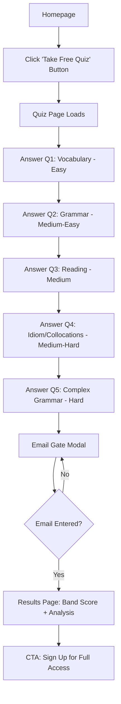

# Interactive English Proficiency Quiz - Lead Magnet Implementation Plan

## Background

This is a **first-value offer** (lead magnet) for non-logged-in visitors. The quiz tests English proficiency through 5 progressively difficult questions and provides an **estimated IELTS band score** (4.5–8.5 range) with personalized recommendations. Users must enter their email to view results, converting visitors into qualified leads.

This aligns with the **Lead Magnet Strategy KI**: transitioning from static PDFs to interactive tools that demonstrate the app's AI-driven, gamified USP.

---

## User Flow



---

## Quiz Question Bank

Each question targets a specific proficiency level. Scoring increases by **1 point per correct answer** (max 5 points).

### Question 1: Vocabulary (Easy - Targets Band 4-5)
**Type:** Multiple choice  
**Topic:** Common everyday words

**Question:** *"Choose the word that best completes the sentence: 'I need to _____ my passport before I travel.'"*

- A) Renew ✅ (Correct)
- B) Repair
- C) Replace
- D) Return

**Why it's easy:** "Renew" is a common verb for documents. Band 4-5 students should know basic administrative vocabulary.

---

### Question 2: Grammar (Medium-Easy - Targets Band 5-6)
**Type:** Error identification  
**Topic:** Present Perfect vs. Simple Past

**Question:** *"Which sentence is grammatically correct?"*

- A) I have seen that movie yesterday.
- B) I saw that movie yesterday. ✅ (Correct)
- C) I have saw that movie yesterday.
- D) I am seeing that movie yesterday.

**Why medium-easy:** Band 5-6 students struggle with perfect tenses. This tests understanding of time markers ("yesterday" = simple past).

---

### Question 3: Reading Comprehension (Medium - Targets Band 6-7)
**Type:** Inference from short passage  
**Topic:** Workplace communication

**Passage:**
> *"The new policy requires all employees to submit monthly reports by the first Friday of each month. Failure to comply may result in delayed performance reviews."*

**Question:** *"What is the primary purpose of this policy?"*

- A) To punish employees who miss deadlines.
- B) To ensure timely tracking of employee performance. ✅ (Correct)
- C) To reduce the workload of managers.
- D) To replace annual performance reviews.

**Why medium:** Requires inference ("ensure timely tracking") rather than direct information. Band 6-7 students can handle implied meaning.

---

### Question 4: Advanced Vocabulary / Collocations (Medium-Hard - Targets Band 7-8)
**Type:** Collocation selection  
**Topic:** Academic/formal language

**Question:** *"Which phrase is most appropriate in formal academic writing?"*

- A) The study **makes clear** that climate change is accelerating.
- B) The study **demonstrates** that climate change is accelerating. ✅ (Correct)
- C) The study **shows off** that climate change is accelerating.
- D) The study **points out** that climate change is accelerating.

**Why hard:** Band 7-8 students must know formal register. "Demonstrates" is more academic than "makes clear" or "points out." "Shows off" is informal/incorrect.

---

### Question 5: Complex Grammar (Hard - Targets Band 8+)
**Type:** Advanced sentence structures  
**Topic:** Conditional/subjunctive mood

**Question:** *"Choose the most grammatically accurate sentence:"*

- A) If I would have known about the meeting, I would attend it.
- B) Had I known about the meeting, I would have attended. ✅ (Correct)
- C) If I had known about the meeting, I would attend it.
- D) If I have known about the meeting, I would have attended.

**Why very hard:** Tests third conditional + inversion ("Had I known" = advanced structure). Only Band 8+ students consistently use this correctly.

---

## Band Score Estimation Algorithm

| Score | Estimated Band | CLB Equivalent | Proficiency Level |
|---|---|---|---|
| 0/5 | Band 4.5 | CLB 4-5 | Limited User |
| 1/5 | Band 5.0 | CLB 5-6 | Modest User |
| 2/5 | Band 5.5 | CLB 6 | Modest User |
| 3/5 | Band 6.5 | CLB 7 | Competent User |
| 4/5 | Band 7.5 | CLB 8-9 | Good User |
| 5/5 | Band 8.5 | CLB 10+ | Very Good User |

### Calculation Logic
```javascript
function calculateBandScore(correctAnswers) {
  const bandMap = {
    0: { band: 4.5, clb: "4-5", level: "Limited User" },
    1: { band: 5.0, clb: "5-6", level: "Modest User" },
    2: { band: 5.5, clb: "6", level: "Modest User" },
    3: { band: 6.5, clb: "7", level: "Competent User" },
    4: { band: 7.5, clb: "8-9", level: "Good User" },
    5: { band: 8.5, clb: "10+", level: "Very Good User" }
  };
  return bandMap[correctAnswers];
}
```

---

## Implementation Details

### Phase 1: Quiz Page (`free-quiz.html`)

#### Structure
```html
<body>
  <!-- Progress bar at top -->
  <div class="quiz-progress">
    <div class="progress-bar" id="quiz-progress"></div>
    <span id="question-counter">1 / 5</span>
  </div>

  <!-- Question card -->
  <div class="question-card" id="question-card">
    <div class="question-tag">Question 1</div>
    <h2 class="question-text" id="question-text"></h2>
    
    <!-- Passage (conditional for Q3) -->
    <div class="passage-box" id="passage-box" style="display:none;"></div>
    
    <!-- Options grid -->
    <div class="options-grid" id="options-grid"></div>
  </div>

  <!-- Navigation -->
  <div class="quiz-footer">
    <button class="btn btn-secondary" id="prev-btn" disabled>← Back</button>
    <button class="btn btn-primary" id="next-btn" disabled>Next →</button>
  </div>
</body>
```

#### JavaScript Logic (`free-quiz.js`)
```javascript
const QUESTIONS = [ /* 5 questions from above */ ];
let currentQuestionIndex = 0;
let userAnswers = []; // Track selected answers
let selectedOptionIndex = null;

function renderQuestion() {
  const q = QUESTIONS[currentQuestionIndex];
  // Update UI: question text, options, passage (if needed)
  // Enable/disable prev/next buttons
}

function handleOptionSelect(index) {
  selectedOptionIndex = index;
  userAnswers[currentQuestionIndex] = index;
  // Highlight selected option
  // Enable "Next" button
}

function nextQuestion() {
  if (currentQuestionIndex < 4) {
    currentQuestionIndex++;
    renderQuestion();
  } else {
    // Quiz complete → show email gate
    showEmailGate();
  }
}

function showEmailGate() {
  // Hide quiz card, show modal with email input
  document.getElementById('email-gate-modal').style.display = 'flex';
}
```

---

### Phase 2: Email Gate Modal

#### Modal HTML
```html
<div id="email-gate-modal" class="modal" style="display:none;">
  <div class="modal-content brutalist-card">
    <h2>🎉 Quiz Complete!</h2>
    <p>Enter your email to see your estimated band score and personalized study plan.</p>
    
    <form id="email-form">
      <input type="email" id="email-input" class="input-field" 
             placeholder="student@example.com" required>
      <button type="submit" class="btn btn-primary full-width">
        View My Results →
      </button>
    </form>
    
    <p class="small-text">We'll send your results + a free study guide to your inbox.</p>
  </div>
</div>
```

#### Submit Handler
```javascript
document.getElementById('email-form').addEventListener('submit', (e) => {
  e.preventDefault();
  const email = document.getElementById('email-input').value;
  
  // Store email (localStorage for demo, or POST to API)
  localStorage.setItem('userEmail', email);
  
  // Calculate score
  const score = calculateScore();
  localStorage.setItem('quizScore', JSON.stringify(score));
  
  // Redirect to results page
  window.location.href = 'quiz-results.html';
});

function calculateScore() {
  let correct = 0;
  QUESTIONS.forEach((q, i) => {
    const correctIndex = q.options.findIndex(o => o.isCorrect);
    if (userAnswers[i] === correctIndex) correct++;
  });
  return calculateBandScore(correct);
}
```

---

### Phase 3: Results Page (`quiz-results.html`)

#### Layout
```html
<body>
  <div class="results-container">
    <!-- Band Score Hero -->
    <div class="results-hero brutalist-card">
      <div class="pill pill-accent">Your Estimated Band Score</div>
      <h1 class="band-score">7.5</h1>
      <p class="band-descriptor">Good User (CLB 8-9)</p>
      <div class="score-breakdown">
        You answered <strong>4 out of 5</strong> questions correctly!
      </div>
    </div>

    <!-- Strengths & Weaknesses -->
    <div class="analysis-grid">
      <div class="analysis-card card-strengths">
        <h3>✅ Your Strengths</h3>
        <ul>
          <li>Vocabulary: Strong command of formal words</li>
          <li>Grammar: Accurate use of tenses</li>
        </ul>
      </div>
      <div class="analysis-card card-weaknesses">
        <h3>⚠️ Areas to Improve</h3>
        <ul>
          <li>Advanced structures: Practice conditionals</li>
        </ul>
      </div>
    </div>

    <!-- Recommendations -->
    <div class="recommendations brutalist-card">
      <h2>📚 Your Personalized Study Plan</h2>
      <div class="recommendation-list">
        <!-- Dynamic based on score -->
        <div class="rec-item">
          <div class="icon-box">📖</div>
          <div>
            <h4>Focus on Writing Task 2</h4>
            <p>Practice academic essays to reach Band 8</p>
          </div>
        </div>
      </div>
    </div>

    <!-- CTA -->
    <div class="cta-box">
      <h2>Ready to reach your target score?</h2>
      <a href="signup.html" class="btn btn-primary">Start Free Trial →</a>
    </div>
  </div>
</body>
```

#### Dynamic Recommendations Logic
```javascript
const recommendations = {
  4.5: [
    { icon: "📚", title: "Build Core Vocabulary", desc: "Focus on 1000 most common IELTS words" },
    { icon: "✍️", title: "Grammar Foundations", desc: "Master present/past tenses" }
  ],
  5.0: [
    { icon: "📖", title: "Reading Practice", desc: "Read short articles daily" },
    { icon: "🎧", title: "Listening Skills", desc: "Watch English videos with subtitles" }
  ],
  // ... up to 8.5
};

// Load from localStorage and render
```

---

### Phase 4: Homepage Integration

#### Add Button to Hero Section
Edit `index.html` lines 52-55:

```html
<div class="hero-actions">
  <a href="free-quiz.html" class="btn btn-primary">Take Free Quiz 🎯</a>
  <a href="signup.html" class="btn btn-secondary">Start Free Trial</a>
  <a href="#demo" class="btn btn-outline">View Demo</a>
</div>
```

**Visual hierarchy:** "Take Free Quiz" becomes the primary CTA (green button), "Start Free Trial" becomes secondary.

---

## Styling (Neo-Brutalist)

All styling will be added to `styles.css` to maintain the existing design system.

### Key CSS Classes

```css
/* Email Gate Modal */
.modal {
  position: fixed;
  top: 0;
  left: 0;
  width: 100%;
  height: 100%;
  background: rgba(31, 41, 55, 0.8);
  display: flex;
  align-items: center;
  justify-content: center;
  z-index: 1000;
}

.modal-content {
  max-width: 500px;
  text-align: center;
  animation: popIn 0.3s ease-out;
}

/* Results Page */
.results-hero {
  text-align: center;
  padding: 4rem;
  margin-bottom: 3rem;
}

.band-score {
  font-size: 6rem;
  color: var(--primary);
  text-shadow: 4px 4px 0 var(--border-color);
  -webkit-text-stroke: 2px var(--border-color);
}

.analysis-grid {
  display: grid;
  grid-template-columns: 1fr 1fr;
  gap: 2rem;
  margin-bottom: 3rem;
}

.card-strengths {
  border-color: var(--primary);
  background: #DCFCE7;
}

.card-weaknesses {
  border-color: #FCA5A5;
  background: #FEE2E2;
}
```

---

## File Structure

```
/Users/chenelle/Desktop/Ai study buddy/
├── free-quiz.html        # NEW: Quiz page
├── quiz-results.html     # NEW: Results page
├── free-quiz.js          # NEW: Quiz logic
├── index.html            # EDIT: Add "Take Free Quiz" button
├── styles.css            # EDIT: Add modal + results styles
└── assets/               # (no changes)
```

---

## Verification Plan

### 1. Build Verification
Since this is static HTML/CSS/JS, no build step is needed. Verify by:
- Opening `free-quiz.html` in browser
- Checking console for JavaScript errors

### 2. Functional Testing (Browser Agent)

| Test Case | Steps | Expected Result |
|---|---|---|
| **Quiz Flow** | Open `free-quiz.html` → Answer all 5 questions → Click "Next" | Email gate modal appears |
| **Email Validation** | Leave email blank → Click "View Results" | Browser validation error |
| **Email Submit** | Enter valid email → Submit | Redirects to `quiz-results.html` |
| **Score Calculation** | Answer 4/5 correctly | Results show "Band 7.5" |
| **Recommendations** | View results for different scores | Personalized recommendations render |
| **Homepage CTA** | Click "Take Free Quiz" on homepage | Opens `free-quiz.html` |

### 3. Email Collection via Sender.net API

#### Setup Steps
1. Get API Token from Sender.net dashboard (Settings > API access tokens)
2. Create a Group/List for "Quiz Leads" in Sender.net
3. Note the Group ID (found in Groups section)

#### Environment Variables
Create `.env` file (NEVER commit this):
```
SENDER_API_TOKEN=your_token_here
SENDER_GROUP_ID=your_group_id
```

#### Backend API Endpoint (Required)
Since we can't expose the API token in frontend JavaScript, create a serverless function:

**Option A: Vercel Serverless Function** (`api/subscribe.js`)
```javascript
export default async function handler(req, res) {
  if (req.method !== 'POST') {
    return res.status(405).json({ error: 'Method not allowed' });
  }

  const { email, score, bandLevel } = req.body;

  try {
    // Add subscriber to Sender.net
    const response = await fetch('https://api.sender.net/v2/subscribers', {
      method: 'POST',
      headers: {
        'Authorization': `Bearer ${process.env.SENDER_API_TOKEN}`,
        'Content-Type': 'application/json',
        'Accept': 'application/json'
      },
      body: JSON.stringify({
        email: email,
        groups: [process.env.SENDER_GROUP_ID],
        fields: {
          quiz_score: score,
          band_level: bandLevel,
          quiz_date: new Date().toISOString()
        }
      })
    });

    if (!response.ok) {
      const error = await response.json();
      return res.status(response.status).json({ error: error.message });
    }

    const data = await response.json();
    
    // Trigger automated email campaign
    await fetch('https://api.sender.net/v2/campaigns/trigger', {
      method: 'POST',
      headers: {
        'Authorization': `Bearer ${process.env.SENDER_API_TOKEN}`,
        'Content-Type': 'application/json'
      },
      body: JSON.stringify({
        email: email,
        campaign_id: process.env.SENDER_RESULTS_CAMPAIGN_ID,
        personalization: {
          band_score: bandLevel,
          quiz_score: `${score}/5`
        }
      })
    });

    return res.status(200).json({ success: true, data });
  } catch (error) {
    return res.status(500).json({ error: error.message });
  }
}
```

**Option B: Netlify Function** (similar structure)

#### Frontend Integration
Update the email form handler:
```javascript
document.getElementById('email-form').addEventListener('submit', async (e) => {
  e.preventDefault();
  const email = document.getElementById('email-input').value;
  const btn = e.target.querySelector('button');
  
  // Calculate score
  const score = calculateScore();
  
  // Show loading state
  btn.disabled = true;
  btn.innerText = 'Submitting...';
  
  try {
    const response = await fetch('/api/subscribe', {
      method: 'POST',
      headers: { 'Content-Type': 'application/json' },
      body: JSON.stringify({
        email: email,
        score: score.correctAnswers,
        bandLevel: score.band
      })
    });
    
    if (!response.ok) {
      throw new Error('Failed to submit');
    }
    
    // Store locally for results page
    localStorage.setItem('quizScore', JSON.stringify(score));
    
    // Redirect to results
    window.location.href = 'quiz-results.html';
  } catch (error) {
    alert('Something went wrong. Please try again.');
    btn.disabled = false;
    btn.innerText = 'View My Results →';
  }
});
```

#### Verification
1. Submit test email via quiz
2. Check Sender.net dashboard → Subscribers → verify new contact appears with custom fields
3. Verify automated email is sent with quiz results

### 4. Mobile Responsiveness
Test on mobile viewport (375px width):
- Progress bar remains visible
- Options stack vertically
- Modal is scrollable
- Results cards stack on mobile

---

## User Review Required

> [!IMPORTANT]
> **Sender.net Setup Requirements:**

### Before Implementation:
1. **Sender.net Account**
   - Create account at [sender.net](https://sender.net)
   - Navigate to Settings > API Access Tokens
   - Generate new API token and share it securely (I'll store in `.env`)

2. **Create Email List**
   - In Sender.net dashboard, create a new Group called "Quiz Leads"
   - Note the Group ID (I'll need this for the API)
   - Add custom fields: `quiz_score`, `band_level`, `quiz_date`

3. **Email Campaign Template**
   - Do you want me to create the HTML email template for quiz results?
   - Or will you design it in Sender.net's email builder?
   - Template should include:
     - Personalized greeting with band score
     - Detailed breakdown of strengths/weaknesses
     - CTA to sign up for the platform

4. **Deployment Platform**
   - Since we're using Vercel, I'll create a serverless function (`/api/subscribe.js`)
   - This keeps your API token secure (never exposed to frontend)

### Optional Enhancements:
5. **Analytics** — Should I add event tracking (e.g., Google Analytics, Plausible) to measure:
   - Quiz start rate
   - Drop-off per question
   - Email submission conversion rate

6. **Question Bank** — The 5 questions are sufficient for MVP. Want to add variety later?

---

## Future Enhancements (Post-MVP)

- **Dynamic question pool**: Randomize questions from a bank of 20+
- **AI-powered feedback**: Use GPT to analyze wrong answers and provide custom tips
- **Social sharing**: "I scored Band 7.5! Take the quiz" → generates Instagram story image
- **Leaderboard**: Show top scores (anonymized) to encourage competition
- **Multi-language support**: Translate quiz for Spanish, Mandarin, Hindi speakers
