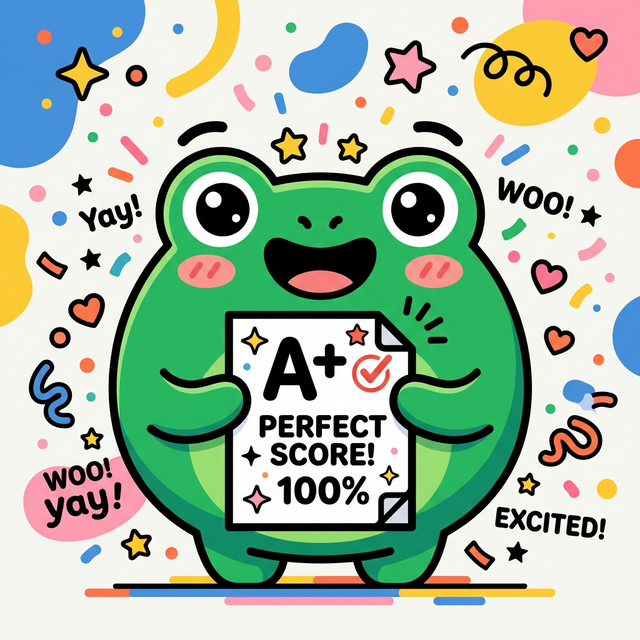

# Email Campaign: Quiz Results Welcome Email
**Platform:** sender.net
**Trigger:** Subscriber completes the Free English Proficiency Quiz and submits email

---

**Subject:** 🎯 Your Band Score + Free Study Guide Inside!
**Preview Text:** Your personalized Lingoleap study plan is ready...

Hey there,

Thank you so much for taking our Free English Proficiency Quiz! 🎉 We are so excited to welcome you to the Lingoleap community. 

As promised, your quiz results are ready. We've calculated your estimated Band Score and put together a personalized study plan and a bonus free study guide just for you. 

**Why this helps:** 

Preparing for the IELTS or CELPIP can often feel overwhelming, but knowing your baseline is the absolute best first step. Your personalized plan breaks down exactly what you need to focus on—from grammar and vocabulary to reading comprehension—so you can stop guessing, save time, and start improving your score today.

Click the button below to get your results and access your free materials:

**[ BUTTON: View My Results & Free Guide ]** *(Link to dashboard/results page)*

Happy studying! We're cheering you on.

Cheers,
The Lingoleap Team 🚀

**P.S.** Keep an eye on your inbox tomorrow! We'll be sharing our #1 secret framework for instantly sounding more natural and confident in your speaking exam. You won't want to miss it! 👀
