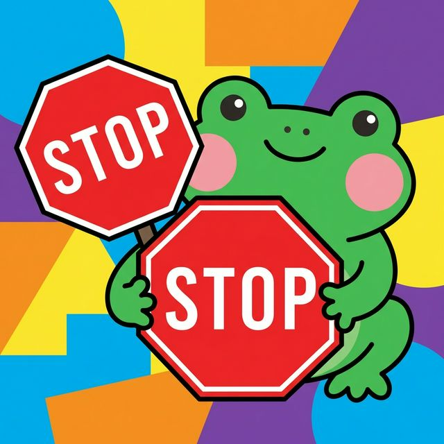
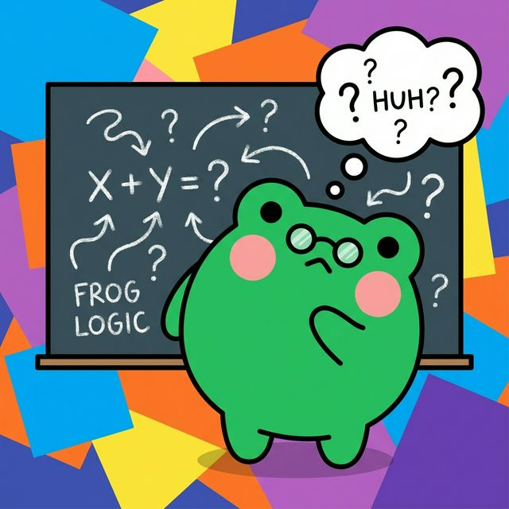
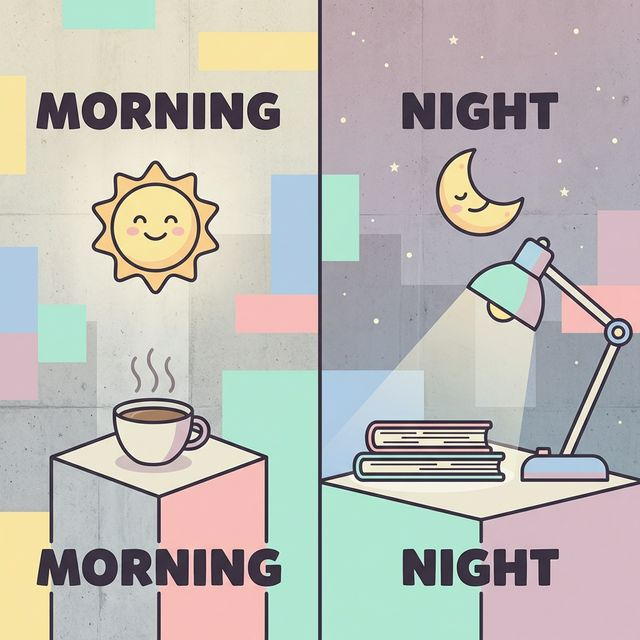
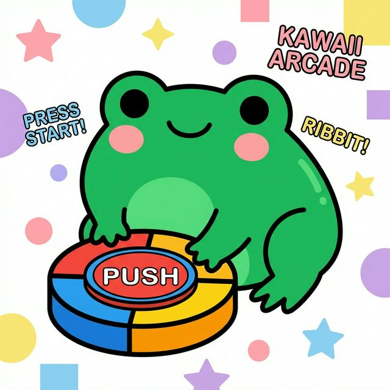
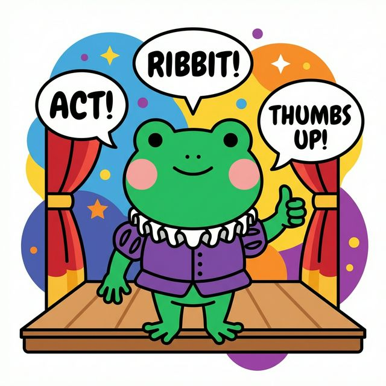
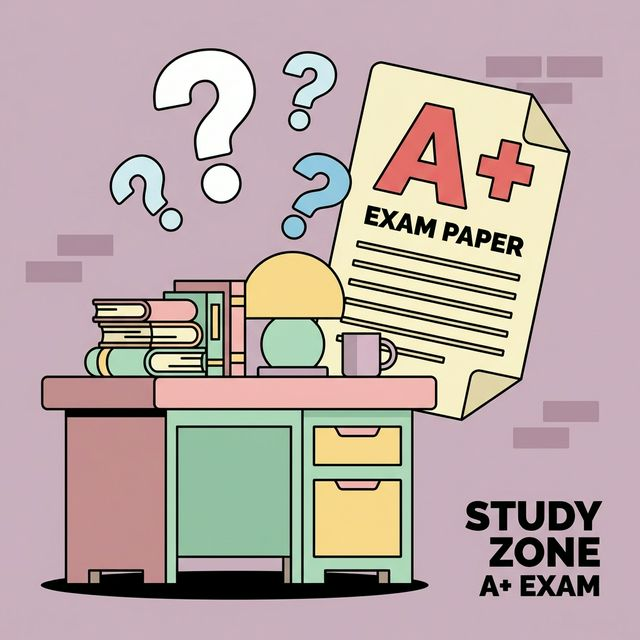
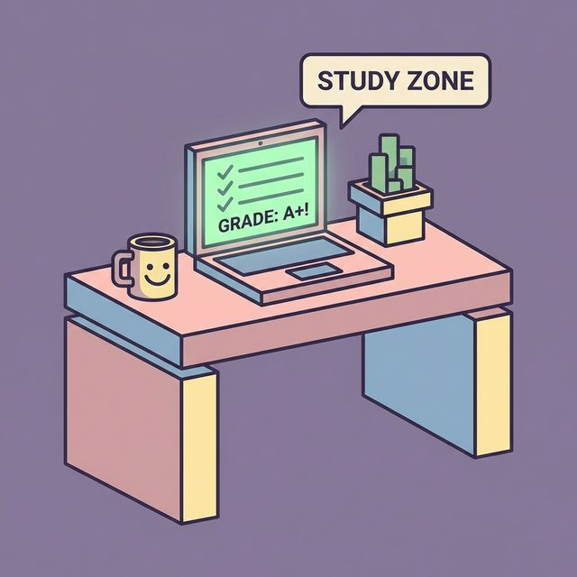
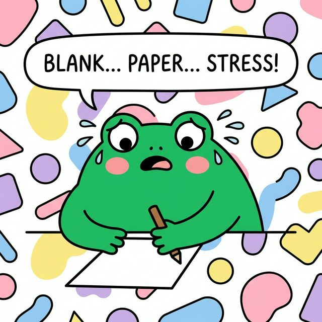
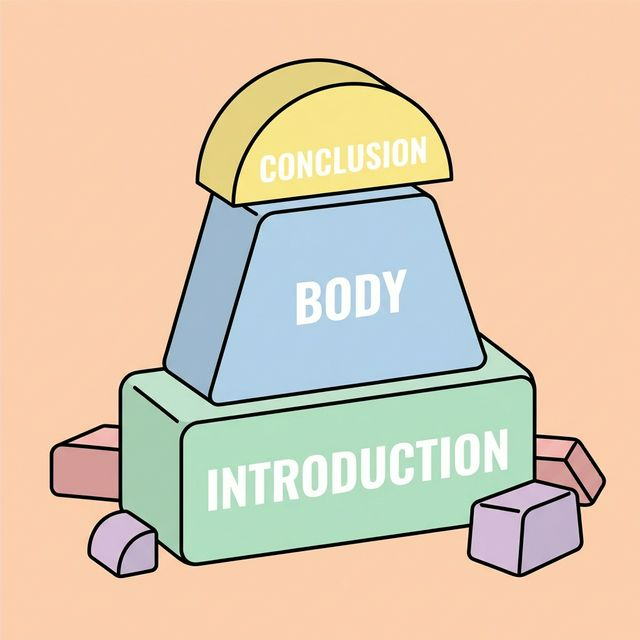
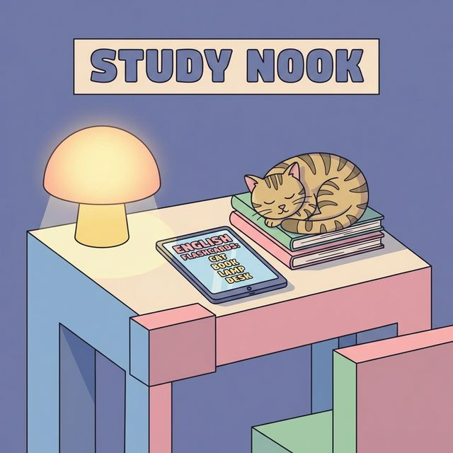

# 10 Instagram Posts for Ai Study Buddy

Based on the Instagram Workflow and Kawaii Neo-Brutalist Strategy.

---

## Post 1: Educational (Vocab)
**Hook:** Stop saying "Very Good" all the time! 🛑🐸
**Image Prompt (Formula A):** a cute kawaii frog holding a large stop sign, vector art style, flat design, thick black outlines, random colorful background, simple minimalist, vibrant green coloring #22C55E, pink blush cheeks #FCA5A5, includes text elements, high quality vector --no shading, gradients, 3d, realistic

**Design Assembly:** 
- **Size:** 1080x1350 (Feed)
- **Background:** Soft Blue (#BFDBFE) pattern
- **Asset:** Center the frog. 
- **Overlays:** Shadowbox border (2px black + 4px offset). Text: "Say THIS instead of VERY GOOD:" using Plus Jakarta Sans Bold.
**Caption:**
- **Headline:** Stop saying "Very Good" all the time! 🛑🐸
- **Body:** Expanding your vocabulary is key to a higher IELTS/CELPIP score! Instead of "very good", try using words like "exceptional", "superb", or "outstanding". Which one will you use today? Let us know below! 👇
- **CTA:** Want to check your IELTS/CELPIP level? Take our FREE interactive quiz! Link in bio. 🔗
**Hashtags:** #ESL #LearnEnglish #StudyGram #IELTSPrep #EnglishTips #KawaiiAesthetic #EdTech #VocabularyUpgrade

---

## Post 2: Educational (Grammar)
**Hook:** Your vs. You're... Let's end the confusion! 🤯
**Image Prompt (Formula A):** a cute kawaii frog looking confused at a chalkboard, vector art style, flat design, thick black outlines, random colorful background, simple minimalist, vibrant green coloring #22C55E, pink blush cheeks #FCA5A5, includes text elements, high quality vector --no shading, gradients, 3d, realistic

**Design Assembly:** 
- **Size:** 1080x1350 (Feed)
- **Background:** Cream (#F5F3F0) solid
- **Asset:** Center the frog with chalkboard.
- **Overlays:** Shadowbox border. Text: "*Your* book vs *You're* studying" (Fredoka One font).
**Caption:**
- **Headline:** Your vs. You're... Let's end the confusion! 🤯
- **Body:** It’s a common mistake, but an easy fix! **Your** shows possession (Your book). **You're** is a contraction for "You are" (You're studying). Don't lose points on simple grammar! 
- **CTA:** Find out where your English skills stand! Take our FREE band score quiz. Link in Bio! 🐸✨
**Hashtags:** #ESL #LearnEnglish #GrammarPolice #IELTSPrep #EnglishTips #KawaiiAesthetic #EdTech #EnglishGrammar

---

## Post 3: Engagement (This or That)
**Hook:** Are you an early bird or a night owl? 🦉🌅
**Image Prompt (Formula B):** a cute kawaii aesthetic split screen, left side morning sun with coffee, right side night moon with a desk lamp, neo-brutalist style, flat illustration, thick dark outlines, pastel color palette, random background color, simple vector style, includes text --no complex details, realistic lighting

**Design Assembly:** 
- **Size:** 1080x1350 (Feed)
- **Background:** Split Coral Pink (#FCA5A5) and Dark Charcoal (#1F2937)
- **Asset:** Center split graphic.
- **Overlays:** Shadowbox border. Bold text overlay: "MORNING vs NIGHT?" 
**Caption:**
- **Headline:** Are you an early bird or a night owl? 🦉🌅
- **Body:** Everyone has their peak productivity time! Do you prefer crushing practice tests with your morning coffee, or focusing deep into the night? Sound off in the comments! ☕️ 🌙
- **CTA:** See how your habits translate to your score! Take the FREE quiz linked in our bio. 🦉
**Hashtags:** #ESL #StudyGram #IELTSPrep #CELPIP #KawaiiAesthetic #EdTech #StudyMotivation #ThisOrThat

---

## Post 4: Promotional (Quiz Feature)
**Hook:** Practice makes perfect... and fun! 🎯
**Image Prompt (Formula A):** a cute kawaii frog pressing a large colorful arcade button, vector art style, flat design, thick black outlines, random colorful background, simple minimalist, vibrant green coloring #22C55E, pink blush cheeks #FCA5A5, includes text elements, high quality vector --no shading, gradients, 3d, realistic

**Design Assembly:** 
- **Size:** 1080x1350 (Feed)
- **Background:** Solid Cream (#F5F3F0) with scattered geometric shapes
- **Asset:** Center the frog pressing the button.
- **Overlays:** Shadowbox border. UI mockup of the AI Study Buddy Quiz interface floating above. 
**Caption:**
- **Headline:** Practice makes perfect... and fun! 🎯
- **Body:** Studying doesn't have to be boring. With our interactive, gamified quizzes, you can level up your English skills while having fun. Track your progress and beat your high score! 📈
- **CTA:** Want to know your estimated band score? Try our FREE, interactive quiz! Link in bio. 💯
**Hashtags:** #ESL #LearnEnglish #StudyGram #IELTSPrep #CELPIPPrep #KawaiiAesthetic #EdTech #Gamification

---

## Post 5: Educational (Idiom)
**Hook:** Don't literally "Break a leg"! 🦵😂
**Image Prompt (Formula A):** a cute kawaii frog dressed in theatre acting clothes giving a thumbs up on stage, vector art style, flat design, thick black outlines, random colorful background, simple minimalist, vibrant green coloring #22C55E, pink blush cheeks #FCA5A5, includes text elements, high quality vector --no shading, gradients, 3d, realistic

**Design Assembly:** 
- **Size:** 1080x1350 (Feed)
- **Background:** Vibrant Green (#22C55E)
- **Asset:** Frog giving thumbs up.
- **Overlays:** Shadowbox border. Text: "Idiom of the Day: Break a Leg!"
**Caption:**
- **Headline:** Don't literally "Break a leg"! 🦵😂
- **Body:** Taking your IELTS/CELPIP test soon? Break a leg! (That means "Good Luck" in English! 🍀). Native speakers use idioms all the time, and using them correctly can boost your speaking score!
- **CTA:** Ready to test your English skills? Take our FREE quiz to estimate your score. Link in bio! 🍀
**Hashtags:** #ESL #LearnEnglish #EnglishIdioms #IELTSPrep #EnglishTips #KawaiiAesthetic #EdTech #SpeakingEnglish

---

## Post 6: Engagement (Quiz Question)
**Hook:** Can you get this right? Test your knowledge! 🧠
**Image Prompt (Formula B):** a cute kawaii aesthetic study desk scene, floating question marks, a large exam paper with an A plus grade, neo-brutalist style, flat illustration, thick dark outlines, pastel color palette, random background color, simple vector style, includes text --no complex details, realistic lighting

**Design Assembly:** 
- **Size:** 1080x1350 (Feed)
- **Background:** Soft Blue (#BFDBFE) check pattern
- **Asset:** Scene in center.
- **Overlays:** Shadowbox border. Text block with question: "She ____ to the store yesterday. A) go B) goes C) went D) gone"
**Caption:**
- **Headline:** Can you get this right? Test your knowledge! 🧠
- **Body:** Let's see how sharp your grammar is today! Drop your answer (A, B, C, or D) in the comments below! 👇 Extra points if you can explain why!
- **CTA:** Love quizzes? Try our FREE interactive quiz to estimate your IELTS/CELPIP score. Link in bio! 🧠
**Hashtags:** #ESL #LearnEnglish #StudyGram #IELTSPrep #EnglishTips #EnglishQuiz #EdTech 

---

## Post 7: Promotional (Instant Feedback)
**Hook:** Say goodbye to waiting for marking! 🚀
**Image Prompt (Formula B):** a cute kawaii aesthetic study desk scene, a laptop displaying glowing green checkmarks and an instant grade, neo-brutalist style, flat illustration, thick dark outlines, pastel color palette, random background color, simple vector style, includes text --no complex details, realistic lighting

**Design Assembly:** 
- **Size:** 1080x1350 (Feed)
- **Background:** Coral Pink (#FCA5A5) solid background
- **Asset:** Desk scene with laptop.
- **Overlays:** Shadowbox border. Text "Instant AI Feedback = Faster Learning".
**Caption:**
- **Headline:** Say goodbye to waiting for marking! 🚀
- **Body:** Getting feedback is crucial for improvement. With Ai Study Buddy, our AI provides instant, detailed feedback on your writing and quizzes, so you can learn from your mistakes immediately and grow faster! 🌱
- **CTA:** Get a baseline of your current level with our FREE interactive quiz! Link in bio! 🚀
**Hashtags:** #ESL #LearnEnglish #StudyGram #IELTSPrep #CELPIP #KawaiiAesthetic #EdTech #AILearning

---

## Post 8: Engagement (Relatable Struggle)
**Hook:** We've all stared at that blank page... 📄👀
**Image Prompt (Formula A):** a cute kawaii frog stressing out looking at a blank piece of paper and a pencil, vector art style, flat design, thick black outlines, random colorful background, simple minimalist, vibrant green coloring #22C55E, pink blush cheeks #FCA5A5, includes text elements, high quality vector --no shading, gradients, 3d, realistic

**Design Assembly:** 
- **Size:** 1080x1350 (Feed)
- **Background:** Cream (#F5F3F0) solid
- **Asset:** Stressed frog asset.
- **Overlays:** Shadowbox border. Text: "Writing Task 2 got me like..."
**Caption:**
- **Headline:** We've all stared at that blank page... 📄👀
- **Body:** Starting the writing task is always the hardest part! Whose mind goes completely blank when the timer starts? 🙋‍♂️🙋‍♀️ Tell us your biggest struggle with the writing section in the comments! You're not alone!
- **CTA:** Don't stress! See where you currently stand by taking our FREE quiz. Link in bio! 📄
**Hashtags:** #ESL #StudyStruggles #StudyGram #IELTSPrep #CELPIP #WritingTask2 #EdTech #Relatable

---

## Post 9: Educational (IELTS/CELPIP Tip)
**Hook:** The secret to a high speaking score? Structure! 🧱
**Image Prompt (Formula B):** a cute kawaii aesthetic building blocks scene, stacked blocks labeled with introduction body and conclusion, neo-brutalist style, flat illustration, thick dark outlines, pastel color palette, random background color, simple vector style, includes text --no complex details, realistic lighting

**Design Assembly:** 
- **Size:** 1080x1350 (Feed)
- **Background:** Vibrant Green (#22C55E) solid
- **Asset:** Stacking blocks.
- **Overlays:** Shadowbox border. Text box overlay framing the image.
**Caption:**
- **Headline:** The secret to a high speaking score? Structure! 🧱
- **Body:** Whether it's IELTS Part 2 or CELPIP Speaking, structure is everything. Remember to: 1️⃣ Answer the prompt directly. 2️⃣ Give 2-3 detailed examples. 3️⃣ Conclude your thought. Don't just ramble! 🗣️
- **CTA:** Ready to crush your goals? Start by taking our FREE score estimator quiz! Link in Bio. 🗣️
**Hashtags:** #ESL #LearnEnglish #SpeakingTips #IELTSPrep #CELPIPPrep #KawaiiAesthetic #EdTech 

---

## Post 10: Promotional (Study Vibes)
**Hook:** Create a study space you actually *want* to sit at! 🪴💻
**Image Prompt (Formula B):** a cute kawaii aesthetic study desk scene, a cozy glowing desk lamp, a sleeping cat, a tablet showing english flashcards, neo-brutalist style, flat illustration, thick dark outlines, pastel color palette, random background color, simple vector style, includes text --no complex details, realistic lighting

**Design Assembly:** 
- **Size:** 1080x1350 (Feed)
- **Background:** Soft Blue (#BFDBFE) solid
- **Asset:** Center full desk scene.
- **Overlays:** Shadowbox border. Minimalist text box: "Study Vibes".
**Caption:**
- **Headline:** Create a study space you actually *want* to sit at! 🪴💻
- **Body:** A clean, organized, and cozy study desk can deeply impact your focus and motivation. Pair your perfect setup with the perfect app: Ai Study Buddy. Ready to crush those study goals? ✨
- **CTA:** Start your study session right by taking our FREE interactive quiz! Link in bio! ✨
**Hashtags:** #ESL #StudyDesk #StudyGram #IELTSPrep #DeskSetup #KawaiiAesthetic #EdTech #StudyMotivation
