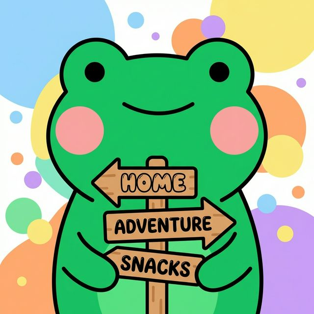
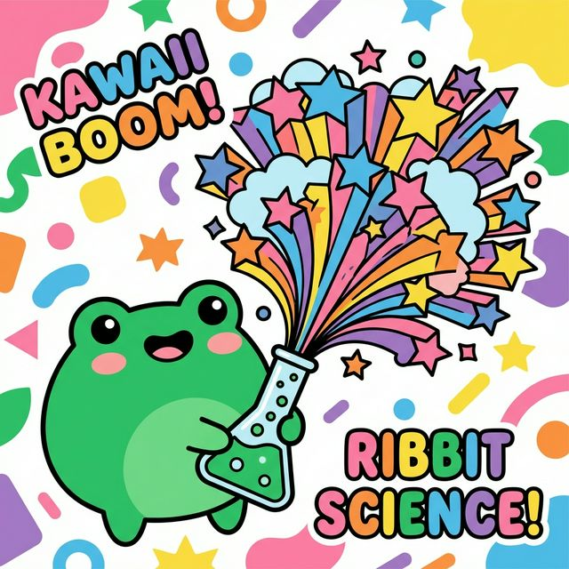
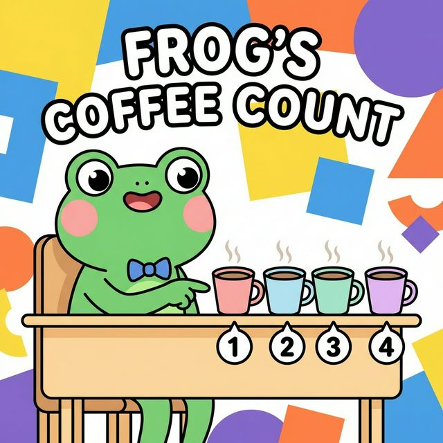
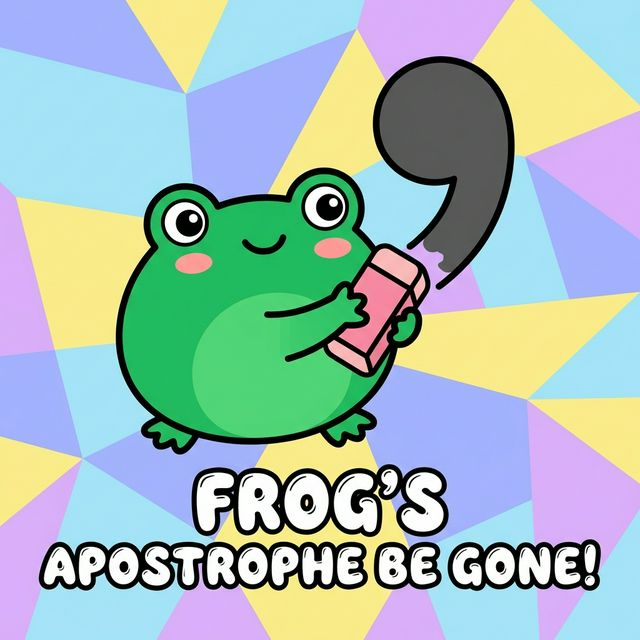

# Instagram Posts: Grammar Tips (Batch 2)

## Post 1: "Their" vs "There" vs "They're"

**Headline:** Stop mixing up "Their", "There", and "They're"! 🛑
**Body:** It's a common mistake, but an easy fix! "Their" shows ownership. "There" refers to a place. "They're" is short for "They are". Master these basics to instantly elevate your writing. ✍️🐸
**CTA:** Want to test your grammar skills? Tap the link in our bio to take the FREE interactive IELTS/CELPIP score estimator quiz now! 👇

**Hashtags:** #LingoLeap #ESL #LearnEnglish #StudyGram #IELTSPrep #EnglishTips #KawaiiAesthetic #EdTech

---

## Post 2: "Effect" vs "Affect"

**Headline:** Do you know the difference between Affect and Effect? 🤔
**Body:** Here's a quick trick: "Affect" is usually an Action (verb), while "Effect" is the End result (noun). Remembering this will save you points on your next essay! 📝✨
**CTA:** Ready to see how your English measures up? Tap the link in our bio to take the FREE interactive IELTS/CELPIP score estimator quiz! 💌

**Hashtags:** #LingoLeap #ESL #LearnEnglish #StudyGram #IELTSPrep #EnglishTips #KawaiiAesthetic #EdTech

---

## Post 3: Fewer vs Less

**Headline:** Are you drinking "less" cups of coffee or "fewer"? ☕
**Body:** Use "fewer" for things you can count (cups, books, frogs 🐸) and "less" for things you can't count (water, time, coffee). Small details make a big difference in fluency! 💡
**CTA:** Curious about your current English level? Tap the link in our bio to take the FREE interactive IELTS/CELPIP score estimator quiz today! 👇

**Hashtags:** #LingoLeap #ESL #LearnEnglish #StudyGram #IELTSPrep #EnglishTips #KawaiiAesthetic #EdTech

---

## Post 4: "Its" vs "It's"

**Headline:** The apostrophe mistake that's costing you marks! ✏️
**Body:** "It's" always means "It is" or "It has". If you can't replace it with "It is", then you need "Its" (no apostrophe), which shows ownership. Keep it simple! 🌟
**CTA:** Test your knowledge and get a personalized study plan. Tap the link in our bio for our FREE interactive IELTS/CELPIP score estimator quiz! 💌

**Hashtags:** #LingoLeap #ESL #LearnEnglish #StudyGram #IELTSPrep #EnglishTips #KawaiiAesthetic #EdTech

---

## Post 5: Then vs Than

**Headline:** Stop saying "Better then before"! 🚫
**Body:** Use "Than" when you are comparing two things (taller than, better than). Use "Then" when talking about time or order (first this, then that). Don't let this tricky pair trip you up! 🕰️🐸
**CTA:** Find out exactly what areas you need to improve! Tap the link in our bio to take the FREE interactive IELTS/CELPIP score estimator quiz! 👇

**Hashtags:** #LingoLeap #ESL #LearnEnglish #StudyGram #IELTSPrep #EnglishTips #KawaiiAesthetic #EdTech

---

## Post 6: "Let's eat, Grandma!" vs "Let's eat Grandma!"

**Headline:** Punctuation saves lives! 👵🍴
**Body:** A simple comma determines if you are inviting your grandma to dinner or serving her for dinner. Always double-check your commas to make sure your sentence means what you think it means! ✍️🐸
**CTA:** Want to make sure your writing is error-free? Tap the link in our bio to take the FREE interactive IELTS/CELPIP score estimator quiz now! 👇

**Hashtags:** #LingoLeap #ESL #LearnEnglish #StudyGram #IELTSPrep #EnglishTips #KawaiiAesthetic #EdTech

---

## Post 7: Lose vs Loose

**Headline:** Don't *lose* points over a *loose* rule! 👖
**Body:** "Lose" means to misplace something or not win (I don't want to lose my keys). "Loose" means not tight (These pants are too loose). Remember: if it has two O's, it has extra room to be loose! 💡
**CTA:** Ready to lock in your English skills? Tap the link in our bio to take the FREE interactive IELTS/CELPIP score estimator quiz! 💌

**Hashtags:** #LingoLeap #ESL #LearnEnglish #StudyGram #IELTSPrep #EnglishTips #KawaiiAesthetic #EdTech

---

## Post 8: Accept vs Except

**Headline:** I *accept* everything... *except* this mistake! 📝
**Body:** "Accept" means to receive or agree to something (I accept your apology). "Except" means to exclude something (Everyone went except me). An easy trick: Ex-cept means Ex-clude! 🔍🐸
**CTA:** See where you stand! Tap the link in our bio to take the FREE interactive IELTS/CELPIP score estimator quiz today! 👇

**Hashtags:** #LingoLeap #ESL #LearnEnglish #StudyGram #IELTSPrep #EnglishTips #KawaiiAesthetic #EdTech

---

## Post 9: Who vs Whom

**Headline:** Who? Whom? How do you choose?! 🦉
**Body:** Here is the ultimate hack: Try substituting "he" or "him". If "he" works, use "who". If "him" works, use "whom". For example: "Who is there?" (He is there). "To whom should I give this?" (Give this to him). You've got this! 🌟
**CTA:** Test your knowledge and get a personalized study plan. Tap the link in our bio for our FREE interactive IELTS/CELPIP score estimator quiz! 💌

**Hashtags:** #LingoLeap #ESL #LearnEnglish #StudyGram #IELTSPrep #EnglishTips #KawaiiAesthetic #EdTech

---

## Post 10: Piece vs Peace

**Headline:** Do you want *peace* on Earth, or a *piece* of cake? 🍰✌️
**Body:** These two sound identical but mean very different things! "Peace" is the opposite of war. "Piece" is a portion of something. Remember: A **piece** of **pie** (pie is in the word piece)! 🧠🐸
**CTA:** Find out exactly what areas you need to improve! Tap the link in our bio to take the FREE interactive IELTS/CELPIP score estimator quiz! 👇

**Hashtags:** #LingoLeap #ESL #LearnEnglish #StudyGram #IELTSPrep #EnglishTips #KawaiiAesthetic #EdTech
