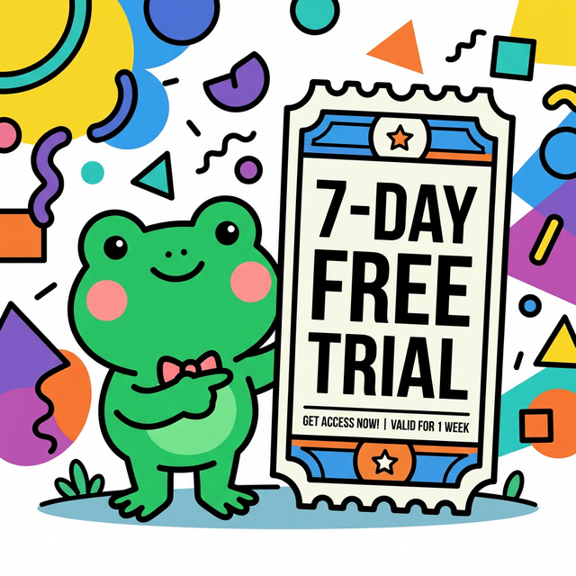
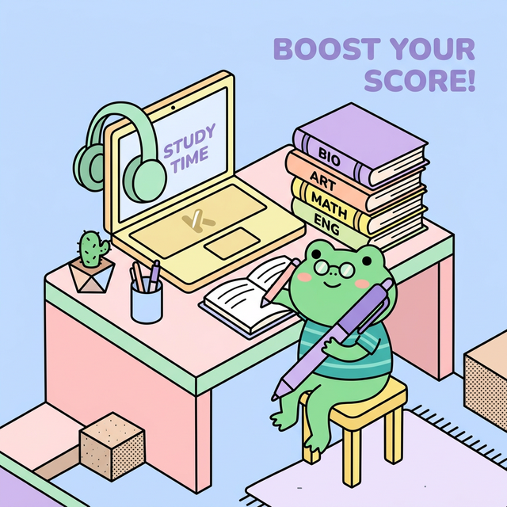
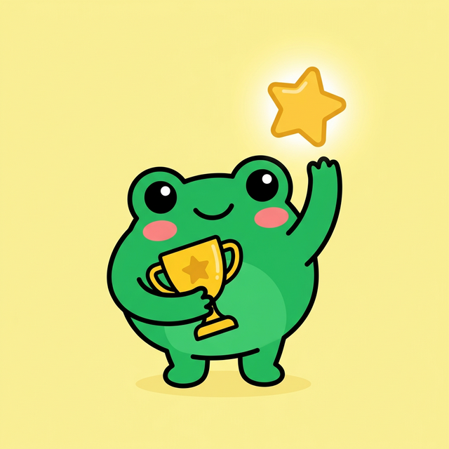

# Day 1 Follow-Up Email Assets

**Email:** `social_media/email_campaigns/day1_trial_offer.md`
**Campaign:** 7-Day Free Trial Offer

Here are 3 generated image variations tailored to the email content and the Kawaii Neo-Brutalist style guide. 

## Variation 1: The Trial Ticket
*Formula A: Mascot "Sticker"*

**Concept:** Mascot pointing to a large "7-Day Free Trial" ticket to visually pop the main offer of the email.

## Variation 2: The Study Scene
*Formula B: The Scene*

**Concept:** Mascot studying at a desk with headphones and books, representing the reading, listening, and writing practice mentioned in the email features.

## Variation 3: Gamified Success
*Formula A: Mascot "Sticker"*

**Concept:** Mascot holding a golden trophy and reaching for a star, emphasizing the "Gamified Practice" (XP, trophies, fun) feature.
