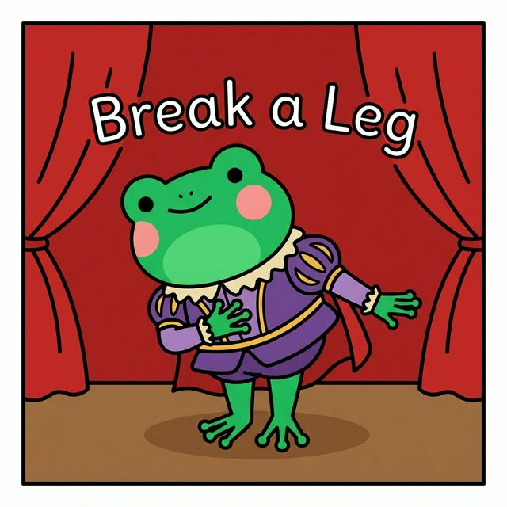
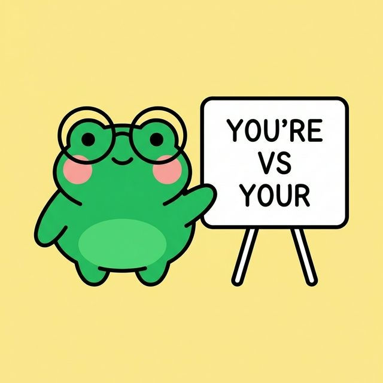
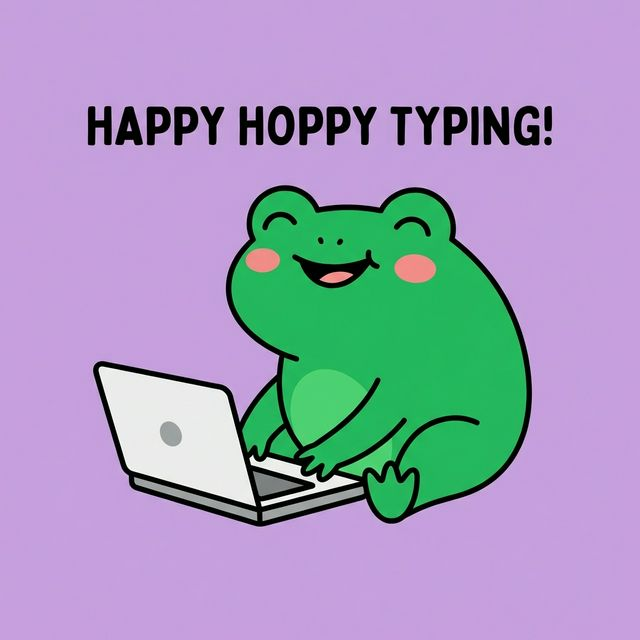
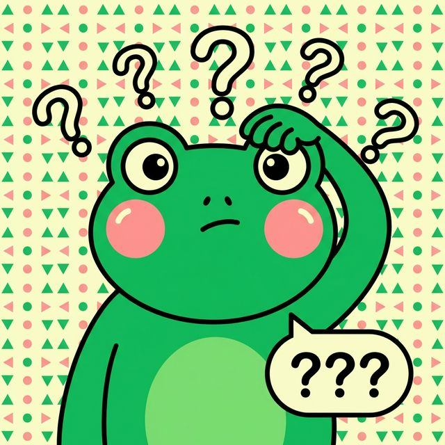
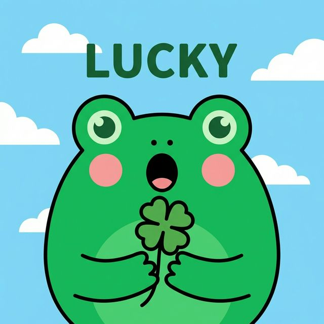
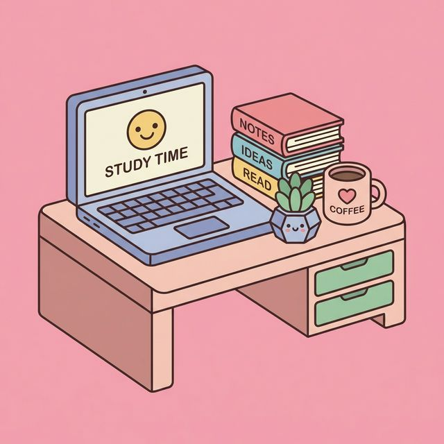
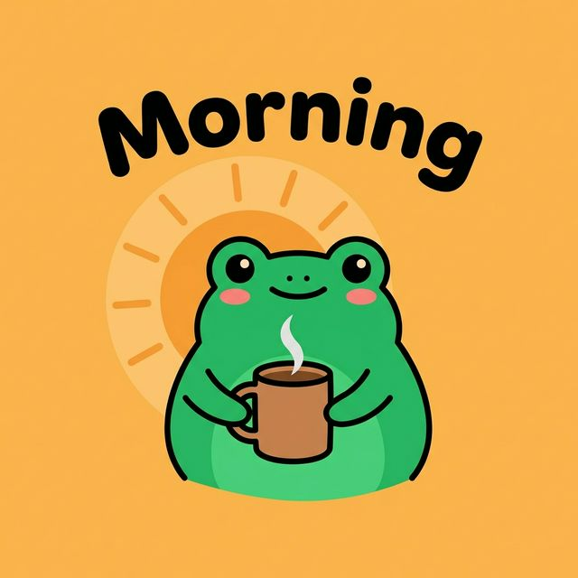
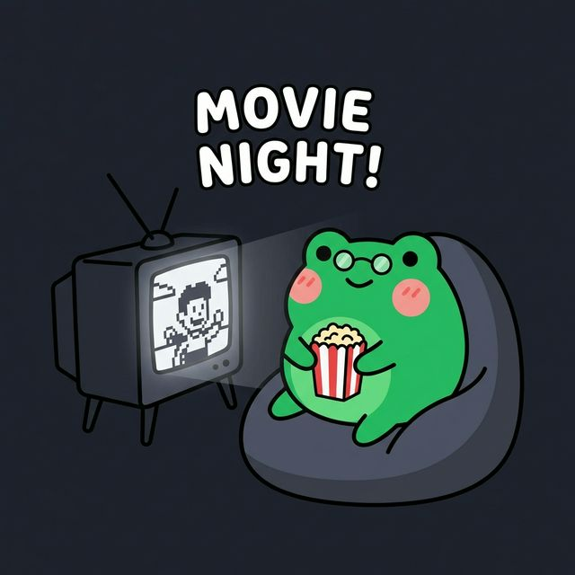
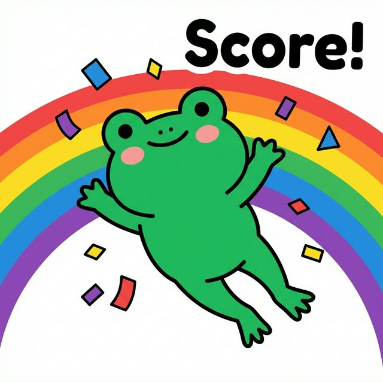
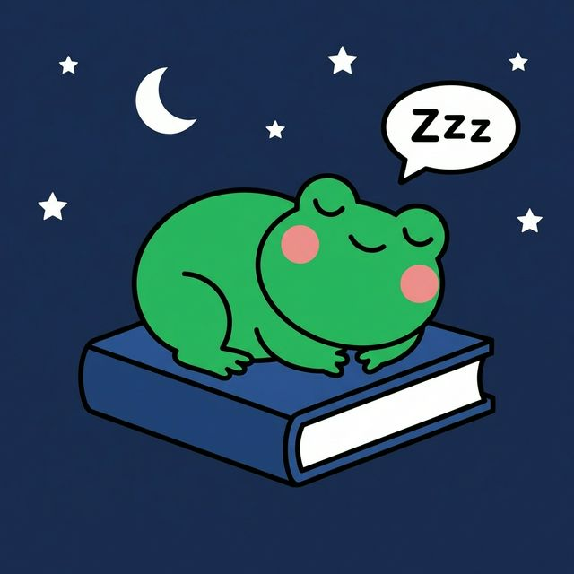

# Generated Instagram Posts

Here are the 10 unique Instagram posts generated for "Ai Study Buddy".

## Post 1: Educational (Idiom)

**Caption:**
**Break a leg? Please don't!** 🎭
Wait, did you think this meant getting hurt? 😱
In English, we say "Break a Leg" to wish someone luck before a performance! But be careful—don't say it before an exam (that's just weird).
**Pop Quiz:** What do you say before a test? 👇
#ESL #Idioms #LearnEnglish #EnglishTips #EnglishSlang

## Post 2: Educational (Grammar)

**Caption:**
**You're vs Your: The Battle Continues!** 🤓
We see this mistake *everywhere* on the internet. Let's fix it once and for all:
✨ **You're** = You are (You're amazing!)
✨ **Your** = It belongs to you (Your English is improving!)
**Tag a friend who needs this reminder! (Don't be shy 😂)**
#GrammarTips #EnglishGrammar #StudyGram #CommonMistakes

## Post 3: Promotional (Feature)

**Caption:**
**Study Smarter, Not Harder.** 💻
Who else is tired of generic quizzes that don't actually help? 🙋‍♀️
Ai Study Buddy creates custom practice tests based on *your* weak spots. Stop wasting time on what you already know!
**Link in bio to try it for free!** 🚀
#EdTech #StudyHacks #AiStudyBuddy #IELTSPrep #SmartStudy

## Post 4: Engagement (Relatable)

**Caption:**
**My brain 90% of the time: 📉**
You know that feeling when the word is on the tip of your tongue, but your brain just... stops?
We call that "Lethologica" (fancy word for a brain freeze!).
**What's a simple word you ALWAYS forget? Tell us below!** 👇
#Relatable #LanguageLearning #StudyStruggles #EnglishProblems

## Post 5: Educational (Vocab)

**Caption:**
**Word of the Day: Serendipity.** 🍀
*Definition:* Finding something beautiful or good without looking for it.
Examples:
1. Finding $10 in your pocket.
2. Meeting your best friend by accident.
3. Finding this app when you were just scrolling! 😉
**Comment 'LUCKY' if you need some good vibes today!** 🌈
#VocabOfTheDay #EnglishVocabulary #Serendipity #PositiveVibes

## Post 6: Promotional (Vibe)

**Caption:**
**Your Desk Needs This Vibe.** ✨
Cluttered desk = Cluttered mind. 🧹
Do you study better in a messy creative chaos or a pristine minimalist setup?
**Rate your current study setup 1-10 in the comments!** 👇
#StudyAesthetic #DeskSetup #KawaiiDesk #StudyInspo #NeoBrutalist

## Post 7: Engagement (This or That)

**Caption:**
**The Great Debate: Team Morning or Team Night?** ☕️ vs 🌙
Are you powering through vocab at 6 AM, or solving grammar puzzles at 2 AM?
We need to settle this debate!
**Drop a ☀️ for Morning Squad or 🌙 for Night Owls!**
#StudyRoutine #MorningMotivation #NightOwl #ProductivityHacks

## Post 8: Educational (Tip)

**Caption:**
**Yes, Netflix counts as studying.** 🍿
(If you do it right!)
Stop feeling guilty about binge-watching. Just turn on the **English subtitles** and pay attention to how they use slang.
**What show are you currently obsessed with? We need recommendations!** 👇
#StudyTips #LearnWithNetflix #EnglishLearning #BingeWatching

## Post 9: Promotional (Success)

**Caption:**
**POV: You just got your IELTS score.** 🎉
Imagine this feeling. You opened the email. You saw the score you needed. You're keeping your dream alive.
Claim this energy for your future self!
**Type 'YES' to claim your dream score!** 🎓
#IELTSResult #SuccessMindset #StudyGoals #Manifestation

## Post 10: Engagement (Weekend)

**Caption:**
**Sunday Scaries? Not here.** 😴
Rest is productive. You cannot pour from an empty cup.
Close the books. Take a nap. You earned it.
**How are you recharging this weekend?**
#SelfCare #StudyBreak #WeekendVibes #MentalHealthMatters
